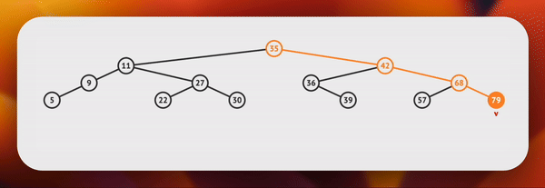

# 1D Range Counting Queries Problem

## 🗓️ Problem Description

The 1D range counting problem involves counting the number of elements within a specified range in a one-dimensional dataset. This is a fundamental problem in computational geometry and databases, often addressed through range queries.

## 📚 Which Data Structure to Use?

### Naive Solution: Binary Search on Sorted Array

Initially, Binary Search seems efficient for 1D Range Counting Queries on a sorted dataset. However, it falls short with dynamic operations like insertions and deletions, disrupting the sorted order.

### ⚡️ Better Option: Binary Search Tree (BST)

For handling dynamic datasets, a Binary Search Tree (BST) is more suitable. BSTs allow for efficient insertions and deletions while maintaining an ordered structure, making them an optimal choice for 1D Range Counting Queries with changing data.

## Comparison

| Data Structure        | Insertion          | Removal           | Range Counting     | Space Complexity   |
| --------------------- | ------------------ | ------------------ | ------------------ | ------------------ |
| Unordered Array       | Amortized O(1)     | \(n\)              | \(n\)              | O(1)               |
| Ordered Array         | \(n\)              | \(n\)              | \( \log(n) \)      | O(1)               |
| Binary Search Tree    | \( \log(n) \)      | \( \log(n) \)      | \( \log(n) \)      | O(n)               |

### Insertion node (17) in BST Demonestration

